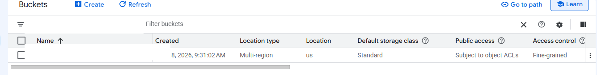
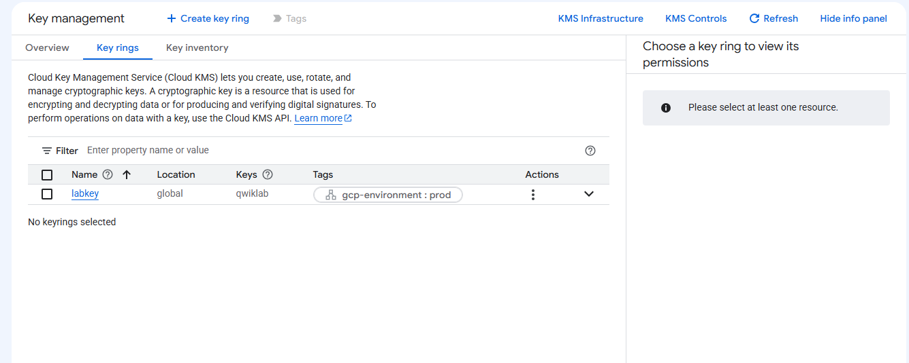
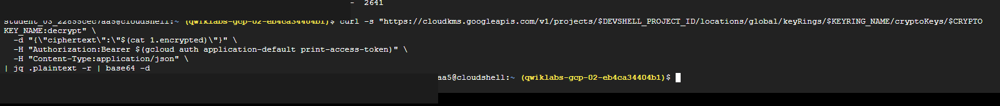
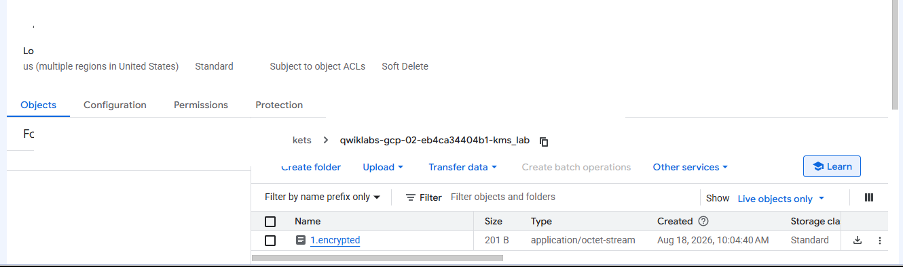
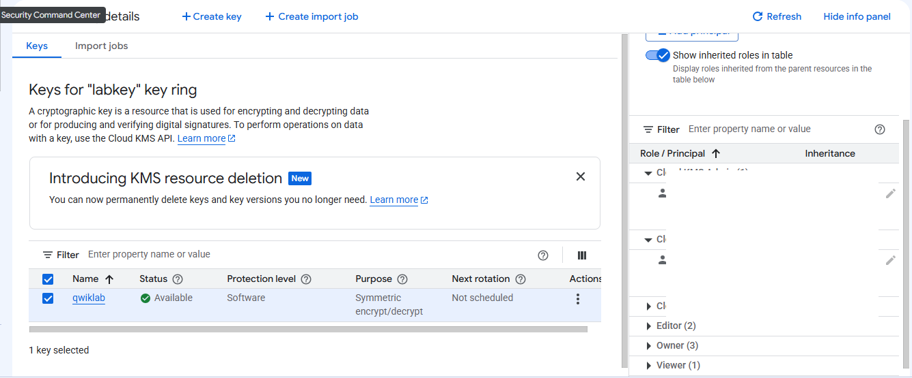

# Google Cloud KMS Encryption and Audit Logging Lab

This repository documents a Google Cloud Skills Boost lab where I worked with Cloud KMS, Cloud Storage, IAM permissions, encryption/decryption, batch encryption, and Cloud Audit Logs.

The lab was useful because it connected several parts of data protection into one workflow: create a storage location, create and use an encryption key, control who can manage or use that key, store encrypted data, and review activity around the KMS resources.

> **Training note:** This was completed in a temporary Google Cloud Skills Boost environment. It was hands-on training, not a production deployment.

## What I Practiced

- Creating a Cloud Storage bucket for encrypted data
- Creating a Cloud KMS KeyRing and CryptoKey
- Encrypting data with the Cloud KMS API
- Decrypting ciphertext to verify the original content
- Uploading encrypted output to Cloud Storage
- Separating KMS administration from encrypt/decrypt permissions
- Working with batch encryption for multiple files
- Reviewing Cloud Audit Logs for KMS activity

## Lab Walkthrough

### 1 — Created the Cloud Storage Bucket

I created a Cloud Storage bucket that would later hold the encrypted output from the lab.

The bucket used standard storage in a US multi-region configuration.



### 2 — Created a KeyRing and CryptoKey

I created a KeyRing named `labkey` in the global location and then created a CryptoKey named `qwiklab` for encryption.

The KeyRing gave me a logical container for the key, while the CryptoKey was the resource used for the encryption and decryption operations.



### 3 — Encrypted and Decrypted a Sample Financial Document

The sample document started as readable plaintext.

I Base64-encoded the content so it could be sent to the Cloud KMS API, then used the `qwiklab` key to encrypt it. Cloud KMS returned ciphertext, which I saved as `1.encrypted`.

I then sent the ciphertext back through the decrypt endpoint and decoded the returned plaintext. The original sample financial document was recovered successfully.



### 4 — Stored the Encrypted File in Cloud Storage

After verifying that decryption returned the original content, I uploaded `1.encrypted` to the Cloud Storage bucket.

The stored object was the encrypted output rather than the readable source document.



### 5 — Configured KMS IAM Permissions

The lab separated two different KMS responsibilities:

- **Cloud KMS Admin** — manage KMS resources such as key rings and keys
- **Cloud KMS CryptoKey Encrypter/Decrypter** — use a key to encrypt and decrypt data

I assigned both roles at the KeyRing level during the lab and verified them in Key Management.



### 6 — Batch Encryption and Audit Logging

In the original completed lab run, I also worked through the remaining workflow:

- copied the sample `finance-dept` files
- used a loop to encrypt multiple files with the KMS API
- uploaded the resulting `.encrypted` files to Cloud Storage
- reviewed Cloud KMS activity through Cloud Audit Logs / Logs Explorer

I did not retain clean public-ready screenshots for those later steps before the training environment expired, so I am not presenting screenshots I cannot verify.

## What I Learned

The biggest takeaway was that there are several different layers involved in protecting data.

The HTTPS/TLS connection protects data while the API request is traveling between the client and Google. Cloud KMS encryption is different: it protects the actual content itself by turning the plaintext into ciphertext.

I also saw why KMS administration and key usage are separated. Someone may need permission to manage keys without necessarily being the same person or service that uses those keys to encrypt and decrypt data.

## Why It Mattered

This lab made the encryption workflow easier to understand as a sequence:

```text
Readable file
    |
    v
Base64 encode for the API
    |
    v
Cloud KMS encrypts the data
    |
    v
Ciphertext saved as 1.encrypted
    |
    v
Decrypt with Cloud KMS to verify recovery
    |
    v
Store encrypted output in Cloud Storage
```

The IAM portion also reinforced least privilege. Managing the KMS infrastructure and using a key for cryptographic operations are separate capabilities and can be granted separately.

The audit-log portion tied encryption back to accountability: key and KeyRing activity can be reviewed to understand who performed actions and when.

## Evidence Notes

The screenshots in this repository were captured from a temporary Google Cloud Skills Boost environment.

Temporary student identifiers, project identifiers, and project-derived bucket names were removed from the portfolio copies. Raw verbose `curl` output was not published because it included temporary authorization tokens and unrelated connection details.

The later batch-encryption and audit-log steps are described from the completed lab workflow, but screenshots are intentionally omitted because clean evidence was not retained.

## Status

✅ Lab completed  
✅ Core KMS evidence documented  
⚠️ Batch-encryption and audit-log screenshots not retained
